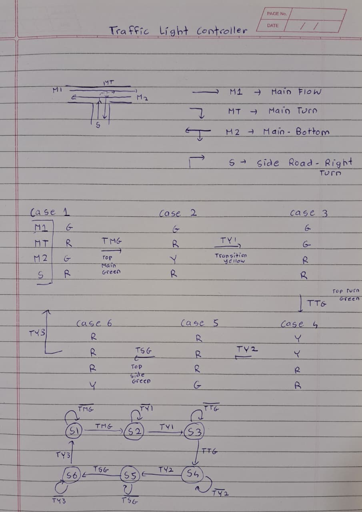

# Verilog Traffic Controller

A 6-state finite state machine (FSM) designed in Verilog to control a T-junction traffic intersection safely and efficiently.

## Junction Design
This project models the following intersection layout:

## Simulation & Output
The design was compiled and simulated using Icarus Verilog (`iverilog`). You can view the full timing breakdown in the `simulation_log.txt` file, which tracks the state changes of the main roads (`M1`, `M2`), main turn (`MT`), and side road (`S`) against the reset (`rst`) and time steps.
